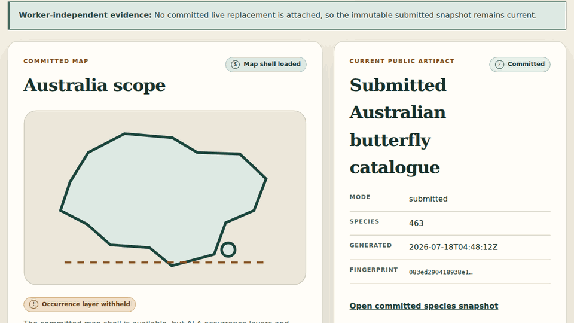

# ButterflyLens

**Australia’s live butterfly evidence map—where a search result stays a hypothesis until the evidence earns a stronger claim.**

<p align="center">
  <a href="https://karikris.github.io/ButterflyLens/#live">
    
  </a>
</p>

[**Help Verify →**](https://karikris.github.io/ButterflyLens/#verify) · [**Open Live Map →**](https://karikris.github.io/ButterflyLens/#live) · [**Run Submitted Replay →**](https://karikris.github.io/ButterflyLens/) · [**Judge Guide →**](JUDGE_GUIDE.md)

| Submitted replay | Current worker status | Measured result |
| --- | --- | --- |
| Available · credential-free and immutable | **Unavailable** · no authenticated heartbeat is attached | **463 accepted species** in the frozen Australian catalogue |

**GPT-5.6:** the evidence analyst is constrained to tool-returned records and explicit uncertainty. The Submitted route is a stored replay and makes no model call. **Codex:** designed, implemented, tested, and documented the evidence system; it does not identify butterflies or cast community reviews.

**Architecture:** `authoritative ALA baseline + unsent Flickr query plan → fingerprinted evidence → optional M5 screening → blind human review → committed map/export`. GitHub Pages serves the worker-independent replay; governed Supabase/B2 live stores and the optional worker are not required to judge it.

## Judge the working product

The public replay needs no login, private key, Supabase account, B2 account,
GPU, model download, or M5 availability. A compact route is:

1. Open **Help Verify** and inspect the rights-cleared image, blind evidence
   controls, uncertainty language, and local draft boundary.
2. Search the submitted catalogue of 463 accepted Australian butterfly species.
3. Open **Live Map** to inspect the Australia scope, exact snapshot fingerprint,
   worker fallback, and the deliberately withheld occurrence layer.
4. Ask ButterflyLens what the submitted artifacts support. The visible answer is
   the fingerprinted, model-free replay—not a hidden live model response.
5. Inspect quality and export surfaces to see which claims remain unavailable or
   release-blocked instead of being rendered as zero.

The GIF above is an eight-frame local capture of that real Submitted map surface.
It contains no third-party photograph and made no external request. “Live Map” is
the product route; its current public data mode remains the Submitted replay.

## The frozen evidence

The canonical [Submitted snapshot](data/submission/v1/submitted_snapshot.json)
has fingerprint
`sha256:27a256934a1ac1a9fb0d27b75a0fe805bf12224df42d7e6b7d235991d26fb9de`.
It records:

- the authoritative rebuilt ButterflyLens ALA baseline: 236,897 selected
  occurrence-evidence rows, 230,027 spatially eligible rows, and 23,744
  aggregate rows;
- 463 accepted species in `australian-butterflies-v1`;
- a deterministic, unsent Flickr plan with 1,876 query definitions and 1,754
  deduplicated physical requests; and
- exact source hashes, review state, map counts, worker contract, and unfinished
  model states.

Those are inventory measurements, not biological completeness or publication
claims. ALA occurrence display and downstream release remain blocked on rights
review for three contributing datasets covering 16,753 selected rows.

## Submitted and live are different states

The Submitted replay is the competition baseline: immutable, fingerprinted,
public, and independent of mutable services. A live replacement is eligible only
after it is explicitly committed and passes the same contracts.

- No authenticated worker heartbeat or committed live artifact is attached.
- YOLOE and BioCLIP work is unfinished and was not executed for this goal.
- The deterministic Flickr plan was not sent by the snapshot freeze. The
  separately active external fetch is excluded until it produces a complete,
  immutable, verified handoff.
- Community writes and account creation remain blocked by the prelaunch privacy
  and security gates. The demo review stays a local, unsubmitted draft.
- Search results remain candidate evidence—not biodiversity records—and ALA
  non-detection is never presented as biological absence.

## System boundaries

The evidence path deliberately separates discovery from scientific release:

```text
ALA evidence ───────────────┐
                           ├─ fingerprinted contracts ─ map / quality / export
Flickr discovery candidates┘             │
                                         ├─ optional M5 screening
                                         ├─ independent human review
                                         └─ GPT-5.6 evidence tools

GitHub Pages ─ immutable Submitted replay
Supabase     ─ governed metadata/review contracts (live writes blocked)
B2           ─ governed object-store boundary (not needed for replay)
```

Every layer preserves source, licence, fingerprint, uncertainty, and release
state. Worker availability can add a status signal but cannot gate the site or
turn a candidate into a verified occurrence.

## Governance and reuse

ButterflyLens code and configuration are `AGPL-3.0-only`. Data, media, model
weights, community content, and third-party software retain their own terms.
Release is blocked unless executable licence, rights, privacy, security, and
scientific gates pass at the release SHA.

Key policies:

- [licence decision](LICENSE_DECISION.md), [third-party audit](THIRD_PARTY_LICENSES.md), and [data-rights audit](DATA_RIGHTS.md);
- [community privacy policy](PRIVACY.md), [community safeguards and moderation policy](MODERATION.md), and [sensitive locations](SENSITIVE_LOCATIONS.md);
- [media rights and removal](MEDIA_RIGHTS.md), [occurrence release](OCCURRENCE_RELEASE.md), and [Darwin Core export](DARWIN_CORE_EXPORT.md); and
- [ALA contribution preparation](ALA_CONTRIBUTION.md) and [release security review](SECURITY_RELEASE_REVIEW.md).

## Develop the replay

The default test path is credential-free and makes no live Flickr, ALA, GBIF,
iNaturalist, OpenAI, Supabase, or B2 call.

```bash
cd apps/web
npm install
npm test
npm run test:browser
```

The complete repository gates also cover Python contracts and integration tests,
frozen Deno Edge tests, cross-language schema parity, rights, licences, secrets,
generated files, and immutable snapshot reproduction.
